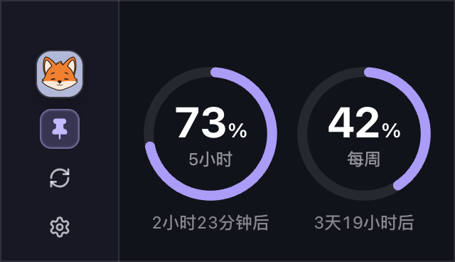

  
  <h1>FoxMeter</h1>
  
<strong>把 Codex 剩余额度留在桌面上</strong>

  
轻量、可置顶的 macOS 用量面板

  

## 功能

FoxMeter 将 Codex 的 **5 小时额度**与**每周额度**放进一个紧凑浮层

- 剩余比例与重置时间
- 窗口置顶与位置记忆
- 自动刷新
- 跟随系统、浅色与深色外观

## 支持

目前仅支持 **Apple Silicon Mac**
